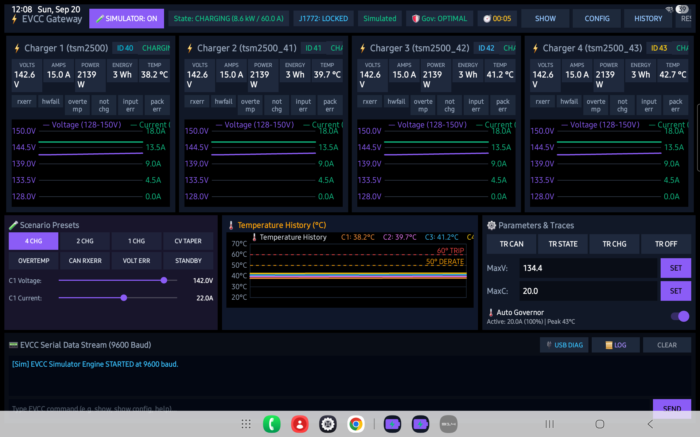

# Android Thunderstruck EV Charger Monitor

A high-performance, standalone Android tablet and automotive head unit application engineered specifically to monitor, control, and analyze electric vehicle charging sessions powered by the **Thunderstruck Motors EV Charge Controller (EVCC)** and up to **4 Thunderstruck / Lear TSM-2500 HF CANbus Chargers**.

This application is an open-source, generic EV charging monitor decoupled completely from any specific vehicle platform, dashboard, or CAN logger.

<p align="center">
  
  <br>
  <em>Figure 1: Standalone Android Tablet Monitor showing 4 chargers active in real-time with dual-axis charts and thermal governor tracking</em>
</p>

---

## ⚡ Companion ESP32 Gateway Firmware

This app communicates seamlessly over Wi-Fi / Local Area Network with the **Thunderstruck EVCC Serial to Wi-Fi Gateway** running on an ESP32-S3:
👉 **[ESP32 Gateway Firmware Repository](https://github.com/mwbrown42/Thunderstruck-EVCC-Serial-to-Wifi-Gateway)**

---

## 🚀 Key Features

- **Zero-Configuration Automatic Gateway Discovery**:
  - Listens asynchronously on UDP broadcast port `8888` for periodic JSON beacon packets (`{"status":"heartbeat","ip":"..."}`) broadcasted by the ESP32 Gateway.
  - Automatically identifies the gateway IP and connects via WebSocket (`ws://<ip>:80/ws`) without requiring the user to configure static IPs or look up DHCP leases.
  - Features an active 4-second watchdog that updates an **Online / Offline** status pill in real-time.

- **Dynamic 1 to 4 Charger Support (Up to 80A Total Charging Current)**:
  - Supports up to 4 parallel TSM-2500 chargers on CANbus IDs 40..43 (`0x28`..`0x2B`):
    - **Charger 1 (`tsm2500`, ID 40)**
    - **Charger 2 (`tsm2500_41`, ID 41)**
    - **Charger 3 (`tsm2500_42`, ID 42)**
    - **Charger 4 (`tsm2500_43`, ID 43)**
  - Handles up to **80.0A** aggregate charging current (4x 20.0A chargers) with live total wattage and amperage calculations.
  - **Dynamic Card Flexibility**: Automatically adapts between 1, 2, 3, or 4 charger cards based on active CAN telemetry with equal-width layout and zero vertical scrolling.

- **Per-Charger Telemetry Gauges**:
  - Digital readouts for:
    - **Voltage** (V)
    - **Current** (A)
    - **Instant Power** (Watts)
    - **Accumulated Session Energy** (Watt-hours / kWh)
    - **Internal Heatsink Temperature** (°C)

- **Fault & Diagnostic Badges**:
  - Instant visual alert pills for all EVCC and TSM-2500 hardware alert states:
    - `rxerr` (CANbus receive error)
    - `hwfail` (Internal hardware failure)
    - `overtemp` (Charger thermal trip / shutdown)
    - `not chg` (Charger not delivering current)
    - `input err` (AC line input voltage out of bounds)
    - `pack err` (Traction battery pack voltage error)

- **Real-Time Synchronized Charging Session Graphs**:
  - Dual-curve canvas graphs overlaying **Voltage** (violet) and **Current** (emerald green) in real-time.
  - Dynamic dual-axis auto-scaling on both voltage and current ranges as charging progresses from Constant Current (CC) to Constant Voltage (CV) taper.

- **Multi-Zone Temperature History Chart**:
  - Displays session temperature traces for each charger against hardware safety thresholds:
    - **50°C Derate Warning Threshold** (amber dash line)
    - **60°C Emergency Trip Boundary** (red dash line — EVCC hard trip cutoff)

- **Intelligent Thermal Governor Integration**:
  - Real-time governor tracking with status pills (`🛡️ Gov: OPTIMAL`, `⚠️ Gov: 75%`, `⚪ Gov: OFF`).
  - Proactively alerts when current has been throttled to prevent thermal shutdowns, showing exact baseline vs derated amperage with a 3°C hysteresis guard (<= 47°C recovery).

- **Bidirectional EVCC Command Console**:
  - Full ASCII serial terminal connected directly to the EVCC at 9600 baud.
  - Quick momentary buttons for standard queries:
    - `SHOW` (Overall EVCC runtime state)
    - `CONFIG` (Active configuration parameters)
    - `HISTORY` (Past charge cycle records)
  - Toggle buttons for EVCC trace modes (`TR CAN`, `TR STATE`, `TR CHG`, `TR OFF`).
  - Input field to adjust `maxv`, `maxc` (up to 80A), or send any arbitrary EVCC CLI command.
  - Built-in session logging with copy-to-clipboard and export.

- **Built-in Interactive Simulator Engine**:
  - Integrated offline simulation engine with 8 realistic scenario presets:
    - **4 Chg**: Full 80A quad-charger session (4x 20A).
    - **2 Chg**: 40A dual-charger session (2x 20A).
    - **1 Chg**: 20A single-charger session.
    - **CV Taper**: Constant voltage current ramp-down.
    - **Overtemp**: Heatsink thermal ramp (>=60°C trip cutoff).
    - **CAN Rxerr**: Simulated CAN bus communication fault.
    - **Volt Err**: Traction battery voltage fault.
    - **Standby**: Idle disconnected state.
  - Interactive voltage and current sliders for dynamic testing without vehicle hardware.

- **Tablet-Optimized Responsive UI**:
  - Custom dark theme UI designed for automotive tablet installations (e.g. 1920x1200, 1280x800).
  - Clean edge-to-edge layout engineered with zero clipping and zero vertical scrolling.

---

## 🛠️ Project Structure

```
Android Thunderstruck EV Charger Monitor/
├── app/
│   ├── src/main/
│   │   ├── java/com/mikeland/thunderstruck/evcc/monitor/
│   │   │   ├── MainActivity.java                # Host activity & lifecycle manager
│   │   │   ├── SettingsActivity.java            # App configuration preferences
│   │   │   ├── controller/
│   │   │   │   ├── EvccGatewayClient.java       # UDP auto-discovery & WebSocket client
│   │   │   │   ├── EvccSimulatorEngine.java     # Offline simulation test harness
│   │   │   │   └── EvccSessionLogger.java       # Session telemetry logging to disk
│   │   │   ├── model/
│   │   │   │   ├── EvccTelemetry.java           # Composite EVCC telemetry model (4 chargers)
│   │   │   │   ├── ChargerTelemetry.java        # Per-charger voltage/current/temp model
│   │   │   │   ├── SessionDataPoint.java        # Time-series graph data point
│   │   │   │   └── ThermalGovernorTelemetry.java# Thermal governor state model
│   │   │   └── view/
│   │   │       ├── ChargingTabViewController.java # Full tab UI controller & event binder
│   │   │       ├── ChargingChartView.java       # Custom Canvas dual-axis chart
│   │   │       └── TemperatureChartView.java    # Multi-charger temperature chart (50°C/60°C)
│   │   ├── res/
│   │   │   ├── layout/                          # Portrait responsive layouts
│   │   │   ├── layout-land/                     # Automotive landscape tablet layouts
│   │   │   ├── values/                          # Colors, styles, strings
│   │   │   └── xml/preferences.xml              # User preferences
│   │   └── AndroidManifest.xml
│   └── build.gradle
├── build.gradle
├── settings.gradle
└── README.md
```

---

## 📡 Network & Protocol Specifications

### 1. UDP Auto-Discovery Beacon (Port 8888)
The companion ESP32 Gateway broadcasts subnet UDP packets on port 8888 every second:
```json
{
  "status": "heartbeat",
  "ip": "192.168.2.148",
  "uptime_s": 3600,
  "wifi_rssi": -48,
  "ws_clients": 1
}
```
The app parses this packet, updates the gateway IP, and connects to the WebSocket endpoint automatically.

### 2. WebSocket Telemetry Stream (`ws://<ip>:80/ws`)
Full telemetry broadcasted at 1 Hz during active sessions:
```json
{
  "type": "telemetry",
  "state": "CHARGE",
  "j1772": "LOCKED",
  "maxv": 142.6,
  "maxc": 80.0,
  "governor": {
    "enabled": true,
    "active_maxc": 80.0,
    "baseline_maxc": 80.0,
    "derate_percent": 100,
    "is_derated": false,
    "peak_temp": 38.5,
    "hottest_charger": "charger",
    "status": "OPTIMAL"
  },
  "c1": {
    "active": true,
    "id": 40,
    "voltage": 142.6,
    "current": 20.0,
    "power": 2852,
    "watt_hours": 1450,
    "temperature": 38.5,
    "rxerr": false,
    "hwfail": false,
    "overtemp": false,
    "not_charging": false,
    "input_voltage_err": false,
    "pack_voltage_err": false
  },
  "c2": {
    "active": true,
    "id": 41,
    "voltage": 142.6,
    "current": 20.0,
    "power": 2852,
    "watt_hours": 1440,
    "temperature": 39.7,
    "rxerr": false,
    "hwfail": false,
    "overtemp": false,
    "not_charging": false,
    "input_voltage_err": false,
    "pack_voltage_err": false
  },
  "c3": {
    "active": true,
    "id": 42,
    "voltage": 142.6,
    "current": 20.0,
    "power": 2852,
    "watt_hours": 1435,
    "temperature": 41.2,
    "rxerr": false,
    "hwfail": false,
    "overtemp": false,
    "not_charging": false,
    "input_voltage_err": false,
    "pack_voltage_err": false
  },
  "c4": {
    "active": true,
    "id": 43,
    "voltage": 142.6,
    "current": 20.0,
    "power": 2852,
    "watt_hours": 1430,
    "temperature": 42.7,
    "rxerr": false,
    "hwfail": false,
    "overtemp": false,
    "not_charging": false,
    "input_voltage_err": false,
    "pack_voltage_err": false
  }
}
```

---

## 🔨 Build & Installation

### Requirements
- Android SDK 29+ (Target SDK: 35)
- Java 17 / Java 11
- Gradle 8.9+ (included wrapper)

### Compiling via Command Line
```powershell
git clone https://github.com/mwbrown42/Android-Thunderstruck-EV-Charger-Monitor.git
cd Android-Thunderstruck-EV-Charger-Monitor
.\gradlew.bat assembleDebug
```

The compiled APK will be located at:
```
app/build/outputs/apk/debug/app-debug.apk
```

### Installing onto Android Device via ADB
```powershell
# Connect to Android device over Wi-Fi ADB
adb connect <DEVICE_IP>:<PORT>

# Install or upgrade
adb install -r app/build/outputs/apk/debug/app-debug.apk

# Launch app
adb shell am start -n com.mikeland.thunderstruck.evcc.monitor/.MainActivity
```

---

## 📄 License
Open-source software developed for electric vehicle builders and EVCC enthusiasts. Released under the MIT License.
